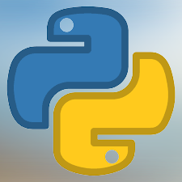

<h1 align="center">
    
</h1>

<h4 align="center"> 
	:heavy_check_mark: Chat Bot Whatsapp :heavy_check_mark:
</h4>


## Sobre o Projeto 💻

Este projeto é pertinente a uma sprint da Escola SENAI Suíco-Brasileira. O projeto visa a criação de uma aplicação que contém foco em um *bot de whatsapp*, que o mesmo será intermediado por uma interface gráfica com funções que interagem com o back-end 📱.

```bash

# Clonar o repositório
$ git clone https://github.com/Paulo-HSO/Bot_Whatsapp
```

## Começando 🏁

Para conseguir utilizar o bot, basta executar o arquivo python *app.py*:


## Observações 📌

A [Interface gráfica](https://docs.python.org/3/library/tkinter.html) da aplicação foi feita utilizando a biblioteca *Tkinter*.


### Tecnologias :large_orange_diamond:

- [Python 🐍](https://www.python.org/downloads/).

### Criado por:

- Mateus Henrique
- Gustavo Lima
- Gustavo Alves
- Paulo Henrique
- Nathaly Ferreira
